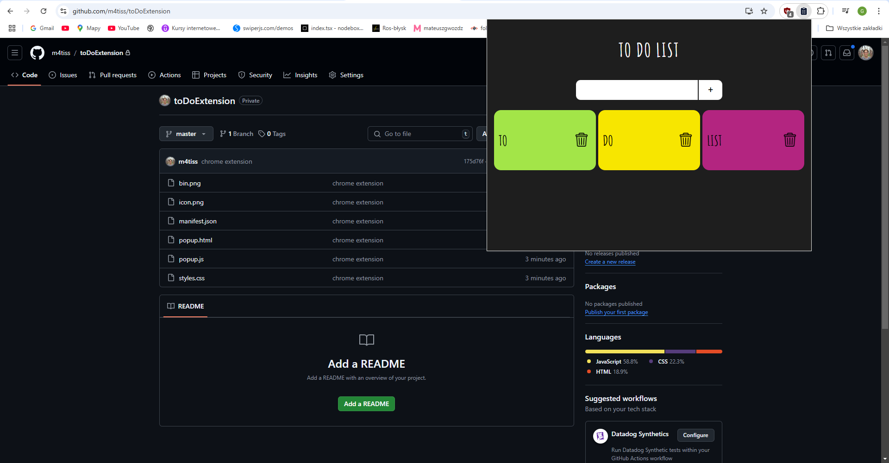

# To-Do Extension

This To-Do Extension is a simple browser extension that helps you manage your tasks.

## How to Install the Extension in Chrome

1. **Download ZIP**: Download the project as a ZIP file from the repository.
2. **Unzip**: Extract the ZIP file on your Desktop.
3. **Open Extensions Page**: In Chrome, go to `chrome://extensions/` and enable **Developer mode**.
4. **Load Unpacked**: Click **Load unpacked**, and select the extracted folder.
5. **Use the Extension**: The extension should appear in the toolbar. Click to use.